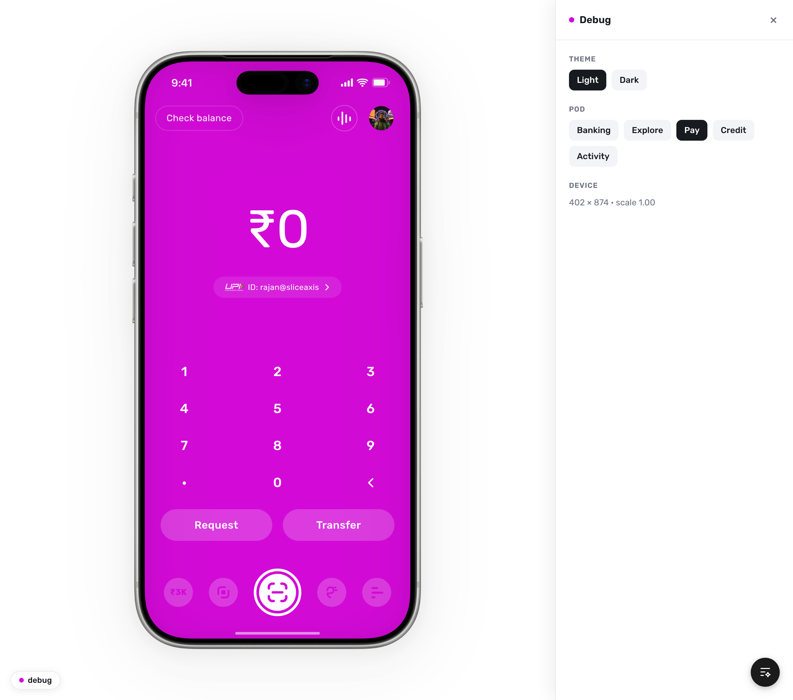

# slice design

slice's design system (DLS 2.0), wired into Claude so you can design and build slice screens just by asking. Comes with a working example app you can open on your phone, and a simple way to teach Claude your taste over time.

<p align="center">
  
  <br/>
  <sub>The example app: slice's Pay screen in an iPhone frame, with the optional design-review panel open.</sub>
</p>

## What you get

- **A slice design expert on tap.** Ask Claude to design, build, or sanity-check any slice screen and it follows DLS 2.0 for you: the right colours, type, spacing, components, motion, and brand voice, automatically.
- **A working example app** (we call it "the proto"): the five main tabs (Banking, Explore, Pay, Credit, Activity) running as a real, tappable iPhone app. It's the source of truth for "what does a slice screen actually look like?" Open it on your desktop or your phone.
- **A way to keep its taste sharp.** A quick "which one feels more slice?" loop you can run anytime. Your picks quietly become rules Claude follows next time.

## How to use it: just talk to Claude

You don't need to learn any commands or jargon. Describe the work in plain language:

- "design a slice screen for [X]"
- "build the Spark FD details screen in Figma"
- "is this slice?" (and paste a screenshot)
- paste a Figma link and ask for a build, a variant, or an audit
- anything about Pay / Valentino purple, Spark, Monies, UPI flows, credit cards

Claude picks the right approach on its own. A few things it always does, so you don't have to ask:

- **Stays on-brand.** Lowercase "slice", the slice purple plus the approved palette, Rubik type, no gray surfaces, no emoji. This holds even when it's exploring something new.
- **Explores when it should.** For genuinely new screens it proposes fresh ideas, but styled *with* slice, never off-brand. (Say "ignore DLS here" if you ever want it to go free-form.)
- **Checks the real source.** It pulls exact values from the published design system instead of eyeballing a screenshot.

## Set it up once

Paste these into Terminal, or just ask Claude: "install the slice design skills".

```bash
ln -s "$(pwd)/skills/slice-design"             ~/.claude/skills/slice-design
ln -s "$(pwd)/skills/slice-design-calibrate"   ~/.claude/skills/slice-design-calibrate
ln -s "$(pwd)/commands/update-slice-design.md" ~/.claude/commands/update-slice-design.md
```

Then restart Claude Code (or open a new chat). That's it.

## See the example app

On your computer, or ask Claude to "run the slice proto":

```bash
cd skills/slice-design/proto
npm install        # first time only
npm run dev        # opens at http://localhost:8766
```

It shows in an iPhone frame on desktop, and full-screen on a phone-sized window. Swipe sideways to move between tabs, tap the avatar at the top of any tab to open Profile, and tap a transaction in Activity to see its detail.

**Tip:** there's a hidden review panel for design critique. Add `?debug` to the address (`localhost:8766/?debug`) and press `d`. It opens beside the app, and the normal view always stays clean.

### On your actual phone

You can run the app full-screen on a real iPhone using **Expo Go** (a free app from the App Store). It's the nicest way to feel a slice screen in the hand: true edge-to-edge, with the phone's status bar matching each tab as you swipe.

The setup has a few moving parts, so the easiest path is to **ask Claude: "show the slice proto on my phone via Expo Go"** and let it walk you through it. The full guide lives in `references/reference_expo_on_device.md`.

## Keep slice's taste sharp (optional)

Over time you can teach Claude your judgment. Run:

```
/update-slice-design
```

…or just say "calibrate slice". Claude opens a little web page that shows you pairs of screens. You pick which feels more slice (or flag "neither"), add a note if you like, and your answers quietly become rules it follows afterward. You can stop anytime; nothing needs finishing.

(The first time, just ask Claude to "set up the calibration app" and it builds it for you.)

## Notes for Claude (you can skip these)

- **slice-design wins.** On any conflict with other design skills (impeccable, motion, frontend-design, and so on), slice-design's rules take priority. The full order is at the top of `skills/slice-design/SKILL.md`.
- **The rules live in `skills/slice-design/references/`**: per-component specs, screen recipes, motion, anti-patterns, the running log of calibrated judgments, how to run a project, and how to put the proto on a phone. Claude reads these automatically; `references/INDEX.md` is the map.
- **The proto is the code source of truth.** For "what does this look like in code?", copy from `skills/slice-design/proto/`.

## License

Proprietary. slice-internal. Do not redistribute.
