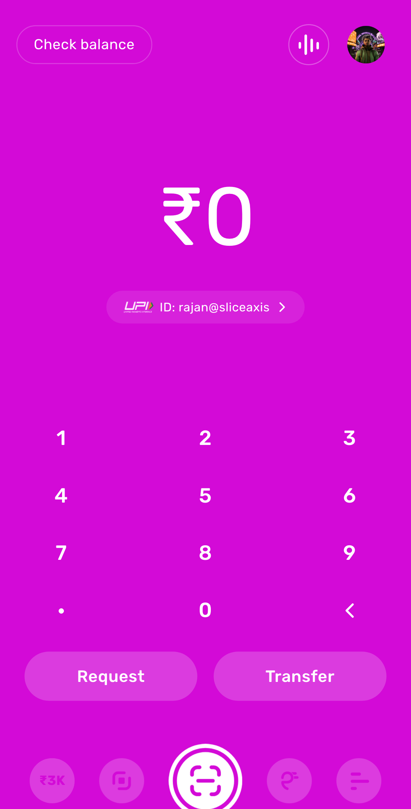

# slice design

A suite of Claude Code skills that encode slice's DLS 2.0 design system — plus a working iPhone-16-Pro proto and the calibration loop that keeps the rules honest.

<p align="center">
  
  <br/>
  <sub>The live proto — Pay / Valentino home, the default landing pod. <code>npm run dev</code> (see below).</sub>
</p>

## What ships

| Piece | Role |
|---|---|
| **`slice-design` skill** | Build, judge, and apply DLS 2.0 to slice screens (Figma execution, web protos, motion, anti-patterns, calibrated judgments). Includes the canonical iPhone 16 Pro proto. |
| **`slice-design-calibrate` skill** | Companion. Walks the senior designer through A/B pairs + "is this slice?" review screens, triages picks + reference frames, promotes the resulting rules into `slice-design/references/`. |
| **`skills/slice-design/proto/`** | Live Vite + React proto — 5 L0 pods (Banking, Explore, Pay/Valentino, Credit, Activity) + L1 routing (Profile, Transaction Detail). The skill's primary reference artifact. |
| **`skills/slice-design/references/proto-snapshot/`** | Frozen point-in-time copy of the proto at the last milestone (currently R24 cont-23) — used as a recipe source when scaffolding a new proto elsewhere. |

The three pieces ship together. Use the proto as the source of truth for any "what does a slice screen look like in code?" question.

## Precedence (non-negotiable)

When working on slice, **slice-design wins** on any contradiction with `impeccable`, `design-motion-principles`, `frontend-design`, `taste-skill`, `brand-guidelines`, or any other design skill. Calibrated overrides inside `references/` win over baseline rules in `SKILL.md`.

Full priority order lives at the top of `skills/slice-design/SKILL.md`.

## Installation

Symlink or copy into your Claude Code skills directory:

```bash
# Symlink (recommended — edits flow in both directions)
ln -s "$(pwd)/skills/slice-design"             ~/.claude/skills/slice-design
ln -s "$(pwd)/skills/slice-design-calibrate"   ~/.claude/skills/slice-design-calibrate
ln -s "$(pwd)/commands/update-slice-design.md" ~/.claude/commands/update-slice-design.md

# Or copy
cp -R skills/slice-design             ~/.claude/skills/slice-design
cp -R skills/slice-design-calibrate   ~/.claude/skills/slice-design-calibrate
cp     commands/update-slice-design.md ~/.claude/commands/update-slice-design.md
```

Restart Claude Code or open a new session for the skills to be picked up.

## Running the proto

```bash
cd skills/slice-design/proto
npm install
npm run dev          # serves on http://localhost:8766
```

The proto renders inside a real iPhone 16 Pro chassis (393×852 logical screen) on desktop, and full-bleed (edge-to-edge, no chassis) at phone viewports. Hot reloading on save. Drags between pods swipe horizontally; tap the avatar in any L0's AppBar to open Profile L1; tap a transaction row in Activity to open Transaction Detail L1. (Port 8766; Vite picks the next free port if it's taken.)

### Debug panel — the proto's second view

The proto ships an **opt-in** debug panel: a right-docked design-review surface that is HIDDEN by default, so the default view always reads as a real app. Both views coexist — the clean app, and the debug panel.

- **Standalone:** add `?debug` to the URL (`http://localhost:8766/?debug`), then open it with the `d` key or the corner `debug` pill. The phone shifts left and the panel docks on the right (two side-by-side views).
- **In a derived project:** the project's own wrapper enables it and injects controls — `<App debug debugContent={<ExplorationControls/>} />`. The panel's built-in theme / pod-jump / device controls come free; `debugContent` is where a project plugs in its section-variant + preset pickers.

This is the reusable exploration-screen framework (`src/components/DebugPanel.jsx` + the `App({ debug, debugContent })` props). Full write-up in `references/reference_project_workflow.md`.

## Using the build / judge side (`slice-design`)

Triggers:
- "design a slice screen for X"
- "build the Spark FD details screen in Figma"
- "is this slice?" + a screenshot
- Pasting a Figma URL and asking for a build / variant / audit
- Anything about Atom / Spark / Monies / UPI flows / Valentino purple / DLS 2.0

The skill self-describes the sub-commands (`build` / `iterate` / `judge` / `audit` / `recipe` / `proto` / `motion` / `calibrate`). It plans internally, executes in one `use_figma` call, then verifies with a screenshot.

### Canonical-fetch-first (R24 meta-rule)

Before claiming any spec value matches DLS, the skill MUST fetch the published variant via `search_design_system` + `figma_get_library_component_by_key`. See `references/reference_canonical_fetch.md` for the full protocol. Eyeballing from screenshots is the single most common source of wrong specs — the rule replaces it with a one-fetch loop that returns exact `paddingTop/Right/Bottom/Left`, `itemSpacing`, `counterAxisAlign`, and per-variant visualSpec.

### Key references

- `reference_canonical_fetch.md` — **R24 meta-rule.** Always fetch the canonical before claiming a spec matches DLS.
- `reference_calibration_log.md` — append-only audit of every promoted rule (since 2026-05-13).
- `reference_calibrated_digest.md` — single-page index of every calibrated rule (read this first when judging).
- `reference_dls_screen_layouts.md` — full screen recipes (Activity L0, Balance L1, PIN entry, Bottom sheet confirm, Spark FD details, Add money, Pay person brand-immersive, Credit bill summary, Action centre, plus L1 overlays).
- `reference_dls_<component>.md` — 30+ per-component spec files including `reference_dls_appbar.md`, `reference_dls_list_items.md`, `reference_dls_avatar.md`, `reference_dls_phone_shell.md` (all updated through R24).
- `reference_anti_patterns.md` — hard "don't do" list + cross-skill conflict table.
- `reference_motion.md` — named durations, easings, choreographies.
- `reference_web_proto.md` — how to start a new slice web proto.
- `reference_project_workflow.md` — how to RUN a multi-round proto engagement: the extension-seam project model, deploy-by-vendoring, the agentation feedback loop, working discipline, and the reusable debug-view / exploration-screen framework.

## Using the calibration loop (`slice-design-calibrate`)

The calibrate skill expects a local web proto at `~/claude/slice/projects/dls-calibration/` to exist. **This repo does not ship that proto** — it's user-specific and contains your own calibration history. Set one up only if you want to run the loop.

### Setting up the calibration proto (one-time)

The proto is a small Vite + React app that the skill drives. The contract it must meet:

- **Port**: serves on `http://localhost:8766/`
- **Pair definitions**: `src/pairs.json` — array of `{id, phase, mode: 'compare' | 'review', component, axis, rule_key, expected_winner, a: {render, props}, b: {render, props}, description, calibrated?}`
- **Log endpoint**: `POST /api/log` — accepts the JSON pick payload, appends to `data/log.jsonl` (or `data/parking_lot.jsonl` if `pick === 'needs_elaboration'`)
- **Attachment endpoint**: `POST /api/attach` — accepts `{session_id, pair_id, mime, data_url}`, saves to `data/attachments/<session>/<file>.<ext>`, returns `{ok, path}`
- **Attachment serve**: `GET /data/attachments/<session>/<file>` — serves saved files back for thumbnail display
- **UI**: a runner that shuffles active pairs, lets the user pick A / B / Neither / Both fine (compare mode) or ✓ Ship / ⚠ Issues / ✗ Not slice (review mode), attach images, and write a reason

Ask Claude Code (with this suite installed) to scaffold one for you:

> "scaffold a slice-design calibration proto at ~/claude/slice/projects/dls-calibration/ matching the slice-design-calibrate skill's contract"

It will set up the Vite app, the middleware endpoints, the DLS primitives, and seed `pairs.json` with a starter round.

### Running the loop

```
/update-slice-design
```

Or in plain text: "calibrate slice", "run the calibration", "triage the calibration log". The skill walks Step 0 → Step 7 (launch server → wait → parking lot → triage → propose diffs → write → suggest next pairs → summary).

## Directory layout

```
slice-design-suite/
├── README.md                                    ← you are here
├── LICENSE
├── .gitignore
├── skills/
│   ├── slice-design/
│   │   ├── SKILL.md                             ← the main skill
│   │   ├── ROADMAP.md / OPEN_ITEMS.md / INTEGRATION_PLAN.md / AUDIT_COMPRESSION.md
│   │   ├── proto/                               ← live Vite + React proto (npm run dev → localhost:8766)
│   │   │   ├── ARCHITECTURE.md / L1_PLAN.md
│   │   │   ├── src/  (App.jsx, components/, pods/, icons/)
│   │   │   ├── public/assets/  (canonical Figma exports)
│   │   │   └── package.json + vite config
│   │   ├── docs/                                ← design audit + quality baseline + proto snapshots
│   │   ├── evals/                               ← skill quality eval cases
│   │   └── references/
│   │       ├── INDEX.md
│   │       ├── reference_canonical_fetch.md     ← R24 meta-rule
│   │       ├── reference_calibrated_digest.md   ← read first when judging
│   │       ├── reference_calibration_log.md     ← append-only audit (R12 → R24)
│   │       ├── reference_anti_patterns.md
│   │       ├── reference_motion.md
│   │       ├── reference_web_proto.md
│   │       ├── reference_project_workflow.md     ← how to run a proto engagement + debug-panel framework
│   │       ├── reference_dls_screen_layouts.md
│   │       ├── reference_dls_<component>.md     ← 30+ component specs
│   │       ├── feedback_*.md                    ← workflow / process rules
│   │       └── proto-snapshot/                  ← frozen proto @ last milestone (R24 cont-23)
│   │           ├── README.md / INDEX.md
│   │           ├── code/  (frozen JSX + scaffold)
│   │           ├── assets/  (frozen canonical PNGs + SVGs)
│   │           └── manifests/  (components.json, assets.json)
│   └── slice-design-calibrate/
│       └── SKILL.md                             ← the calibration loop
├── icons/                                       ← canonical DLS icons (top-level, also mirrored in proto/public)
└── commands/
    └── update-slice-design.md                   ← slash-command pointer to slice-design-calibrate
```

## Maintenance

- New rule comes from a calibration session → `slice-design-calibrate` writes it into the right `reference_*.md` and appends a line to `reference_calibration_log.md`. Commit on the next push.
- A rule turns out wrong → user picks against it again, the loop flips `expected_winner` and updates the rule. Old log entries are never deleted (append-only audit).
- A skill from outside the suite (impeccable, motion, frontend-design) suggests something that contradicts slice → slice-design wins. If the contradiction is structural, append a row to `reference_anti_patterns.md`'s "Cross-skill conflicts" table.
- New proto state landing → refresh `references/proto-snapshot/` (rsync `proto/src` → `code/`, `proto/public/assets` → `assets/`) and bump the snapshot's README banner. Commit the snapshot bump in the same PR as the proto changes.

## Status

Calibrated through **2026-05-29 R24 cont-23** — full L1 routing scaffold (Profile, Transaction Detail), iPhone 16 Pro phone size (393×852), white-on-scroll AppBar+status reserve, drag-vs-click guard on swipeable list rows, canonical avatars (44×44 visual / 48×48 hit, no ring), canonical-fetch-first meta-rule. 100+ promoted rules. Active development.

**2026-06-02** — added the project-workflow reference (`reference_project_workflow.md`), the opt-in debug-panel / exploration-screen framework in the proto (`DebugPanel.jsx` + `App({ debug, debugContent })`), and velocity-aware pager momentum.

## License

Proprietary. slice-internal. Do not redistribute.
